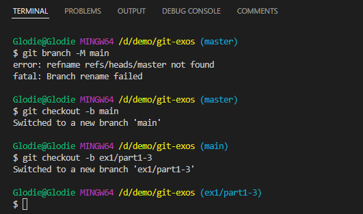

# Correction de l'exercice 1 Partie 1 à 3

## Partie 1
#### Création dossiers git-exos et fichier .gitignore

### contenu .gitignore

### Initalisation dépôt et ajout du remote (dépôt distant)

### Création des branches main et ex1/part1-3

### Création des dossiers exercice1 et img

### État du dépot et premier commit

## Partie 2
### Création du README
Depuis le dossier git-exos
`cd exercice1`
`touch README.md`

### États du dépôt

