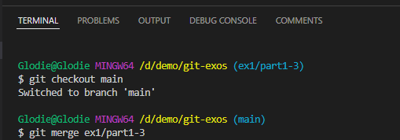
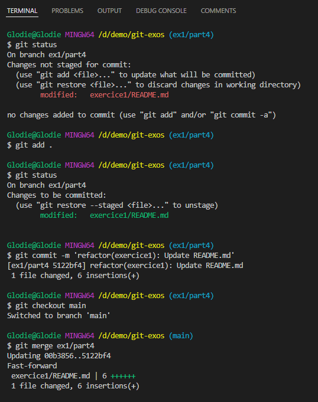
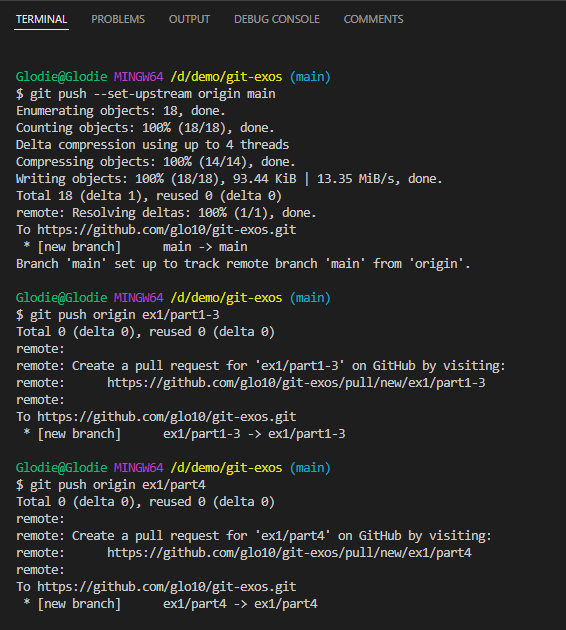

# Correction Partie 4

### Fusion branche ex1/part1-3 dans la branch main

### Création branche ex1/part4
`git checkout -b ex1/part4`
### Modification du README, commit et fusion branche ex1/part4 dans la branche main

### Push de toutes les branches
option `--set-upstream` crée une nouvelle branche sur le dépôt distant cependant sans le mettre git créera quand même une nouvelle branche si celle ci n'éxiste pas au moment du push
