## Correction Partie 7/7

### Création de la nouvelle branche ex1/part7, modification du README.md et commit
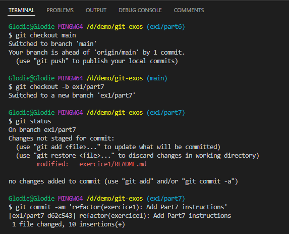
### Déplacement vers la branche ex1/part6, récupération du travail mise de côté
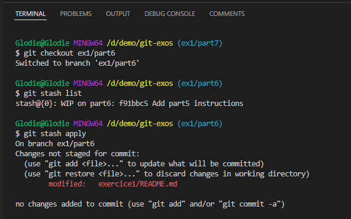
### Commit branche ex1/part6
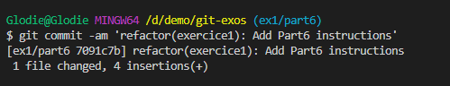
### Fusion branche de la branche ex1/part6 dans ex1/part7
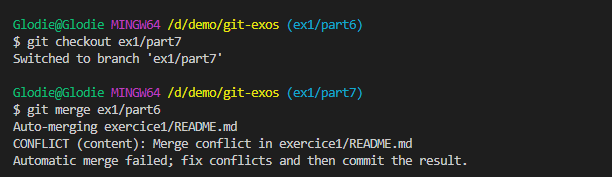
### Conflit
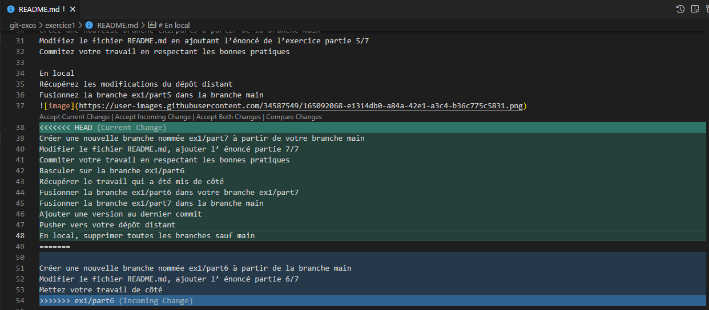
### Résolution du conflit
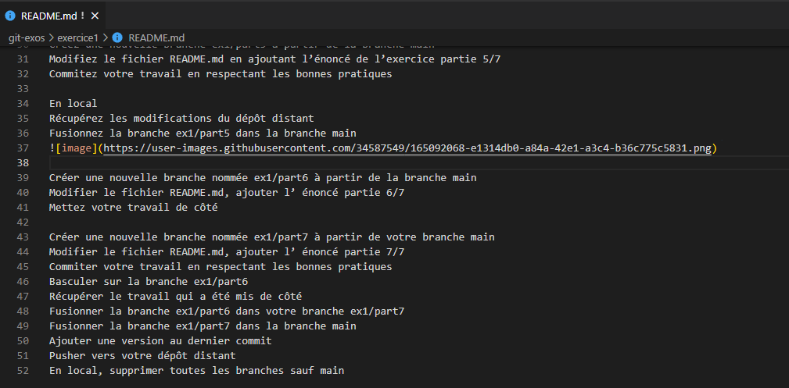
### Commit résolution du conflit
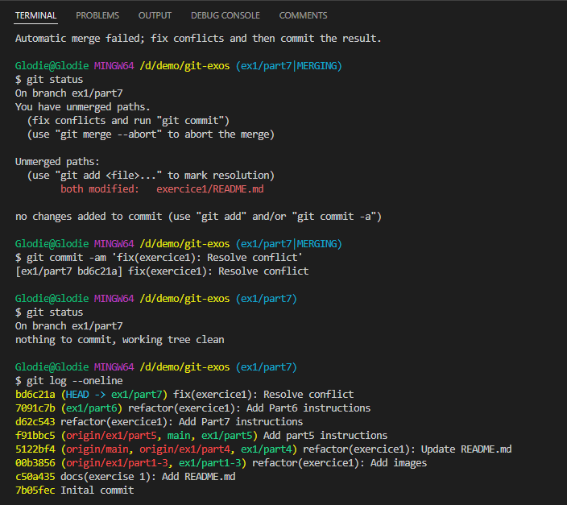
### Fusion branche de la branche ex1/part7 dans main
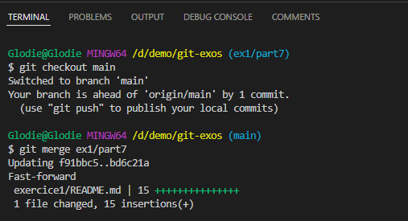
### Ajout d'un tag
**`git tag v1.0.0 -m 'Release v1.0.0'`**
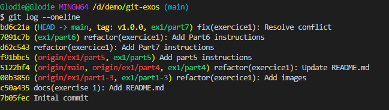
### Push de toutes les branches locales
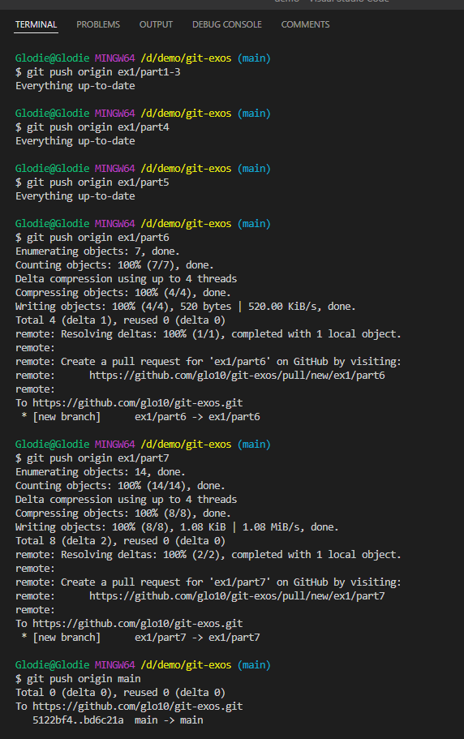
### Nettoyage et suppression des branches locales
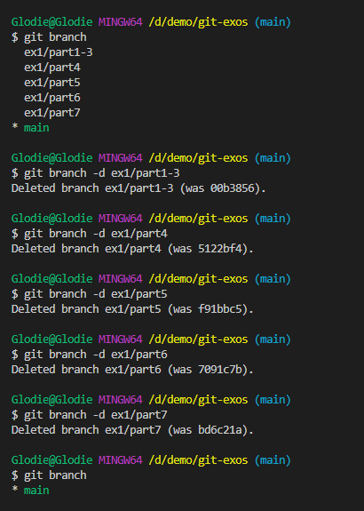