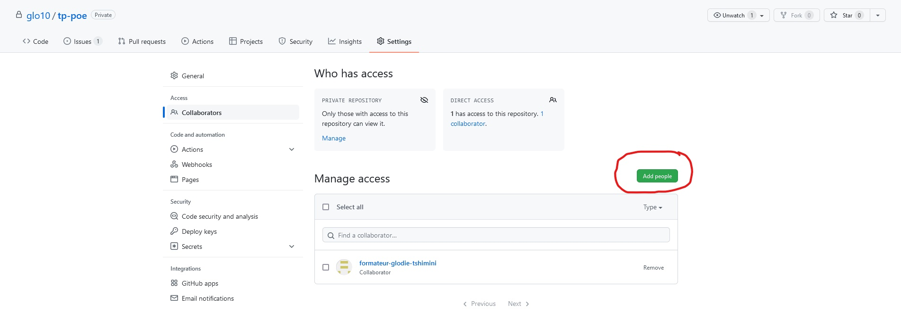
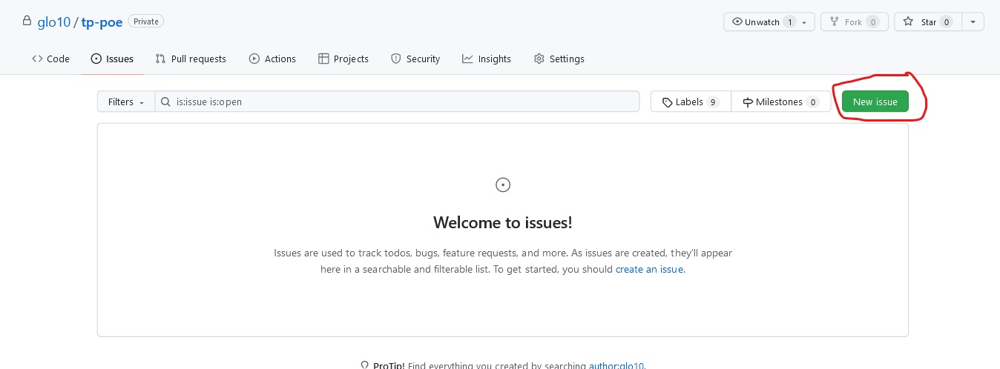
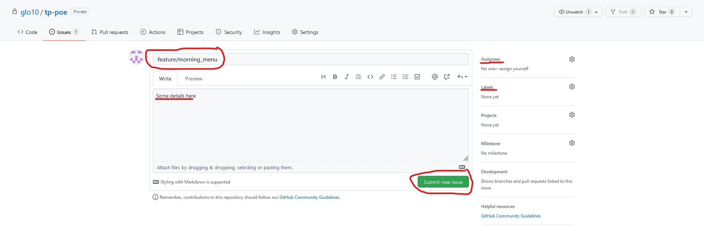
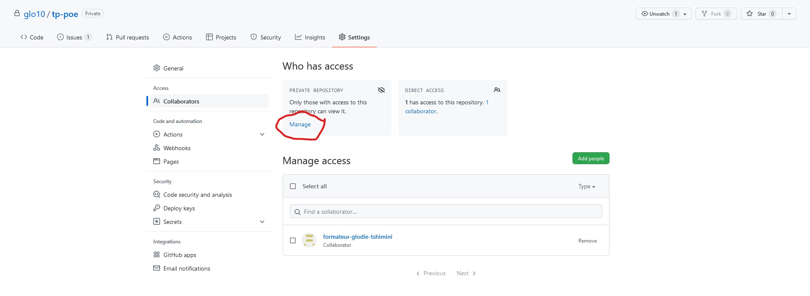
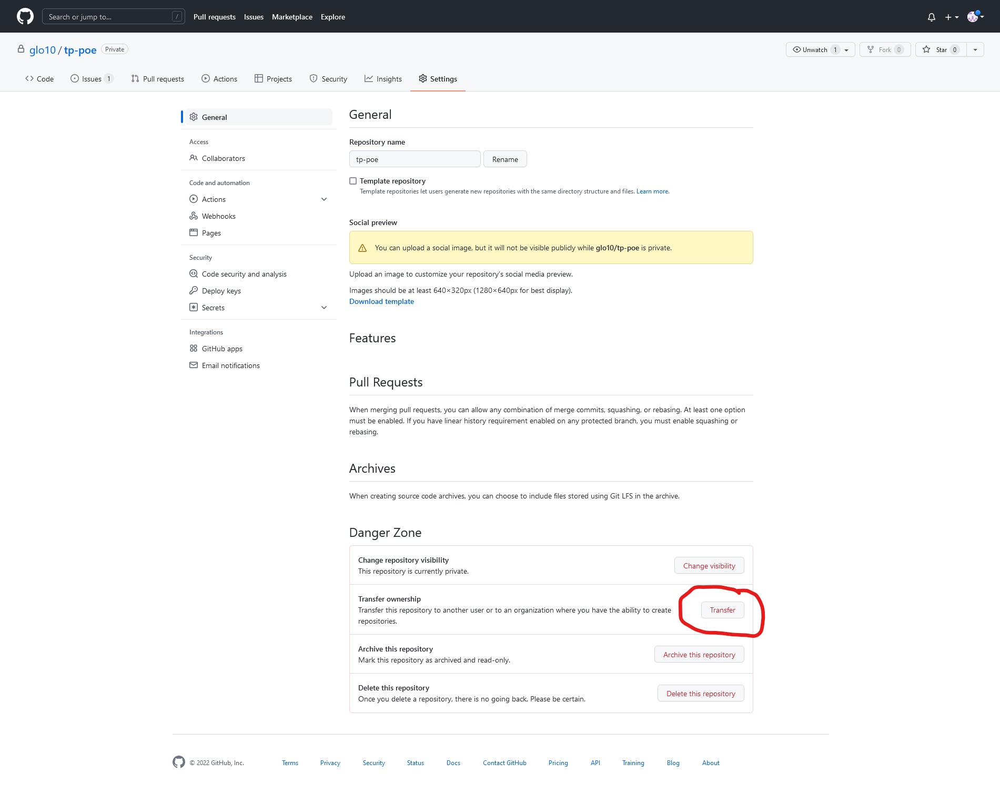

# Travail collaboratif avec Git et Github
## PARTIE 1

#### Formation des groupes

- Groupe de 3 personnes
- Dans chaque groupe
  - 1 *Owner* : créateur et responsable du dépôt Git
  - 2 *Developers* : développeurs extérieurs qui participent au projet

#### Rôle du *owner*

- Tâches du *owner*
1. Créez un dépôt github nommé ***tp-git*** avec les fichiers
   - ***README.md*** contenant les instructions pour récupérer le projet en local
   - ***.gitignore***
   
2. Invitez les 2 développeurs qui doivent collaborer dans ce projet et le formateur dont l'adresse e-mail est *contact@tshimini.fr*

   - **Settings > General > Access > Collaborators > add people**

   **Illustration**

3. Désignez le développeur 1 et le développeur 2 (nécessaire pour attribuer les tâches à chacun)

4. Créez deux *issues* : 

   1. Première *issue* nommée ***feature/morning_menu*** et assignez le développeur 1

   2. Deuxième *issue* nommée ***feature/lunch_menu*** et assignez le développeur 2

      Vous pouvez ajouter les **labels** de votre choix dans la liste proposée à la création
      **Illustrations**
      
      
5. En local :
   
   1. Récupérez le dépôt distant
   2. Créez une branche nommée ***main*** 
   3. Modifiez la mise en page ***README.md*** en suivant ce [guide](https://docs.framasoft.org/fr/grav/markdown.html)
   4. Pushez
  
6. Acceptez, publiez ou rejetez les *pull requests* de vos développeurs
  
   - En cas de rejet, indiquez à vos développeurs le motif du refus grâce aux outils mis à disposition sur Github
   - Gérez les conflits lors des *merge requests* sur la branche *main*
  
7. Après avoir effectué les *merge request*s des travaux de vos développeurs sur la branche *main*
  
   1. Créez une *issue* nommée ***feature/prices*** et assignez-le à vous même
   2. Créez une nouvelle branche qui porte le même nom que *issue*
   3. Ajoutez les prix aux produits présents sur chaque ligne des fichiers ***menu.md*** et ***drink.md***
   4. Pushez vos modifications sur le dépôt distant
   5. Faites le *merge requests* de cette branche dans la branche *main*
  
8. Prévenez vos collaborateurs de l'ajout des prix

#### Rôle du premier développeur

1. Acceptez l'invitation reçue 
2. Récupérez le projet en local
3. Créez une nouvelle branche portant le même nom que *issue* qui vous a été assignée
4. **A la racine du projet**
   1. Créez un fichier nommé ***menu.md*** qui doit contenir vos viennoiseries préférées
   2. Créez un fichier nommé  ***drink.md*** contenant vos boissons favorites pour le petit-déjeuner 
5. Commitez et pushez vers le dépôt distant sur la branche *feature/morning_menu*
6. Faites une demande de *pull request* :
   1. En mettant le développeur 2 en tant que ***Reviewers*** pour la revue du code
   2. Assignez le *owner* dans ***Assignees***
   3. Ajoutez un petit commentaire pour expliquer votre travail
7. Après avoir été notifié de l'ajout des prix par le *owner*
   1. Récupérez tous les changements effectués sur le dépôt distant en local
   2. En cas de conflits, gérez-les en communiquant avec vos collaborateurs
8. Créez une nouvelle branche pour modifier la mise en page des fichiers *menu.md*  et *drink.md* en suivant ce [guide](https://docs.framasoft.org/fr/grav/markdown.html)
9. Soumettez cette branche pour une intégration dans la branche *main* 

#### Rôle du second développeur

1. Acceptez l'invitation reçue 
2. Récupérez le projet en local
3. Créez une nouvelle branche portant le même nom que *issue* qui vous a été assignée
4. **A la racine du projet**
   1. Créez un fichier nommé ***menu.md*** qui doit contenir vos plats préférées
   2. Créez un fichier nommé  ***drink.md*** contenant vos boissons favorites pour le déjeuner 
5. Commitez et pushez vers le dépôt distant sur la branche *feature/lunch_menu*
6. Faites une demande de *pull request* :
   1. En mettant le développeur 1 en tant que ***Reviewers*** pour la revue du code
   2. Assignez le *owner* dans ***Assignees***
   3. Ajoutez un petit commentaire pour expliquer votre travail
7. Après avoir été notifié de l'ajout des prix par le *owner*
   1. Récupérez tous les changements effectués sur le dépôt distant en local
   2. En cas de conflits, gérez-les en communiquant avec vos collaborateurs
8. Créez une nouvelle branche pour modifier la mise en page des fichiers *menu.md*  et *drink.md* en suivant ce [guide](https://docs.framasoft.org/fr/grav/markdown.html)
9. Soumettez cette branche pour une intégration dans la branche *main* 

### PARTIE 2

**En total autonomie**

1. Echangez vos rôles
2. Concertez-vous pour créer des nouvelles *issues* et branches dans le but : 
   - D'étoffer le contenu des fichiers *menu.md* et *drink.md* 
   - De restructurer l'arborescence des fichiers en créant des nouveaux dossiers et/ou fichiers par exemple
   - D'ajouter quelques photos
   - **Et tout ce qui vous passe par la tête**

**Illustrations pour transférer le rôle d'*Owner* à un autre collaborateur**

