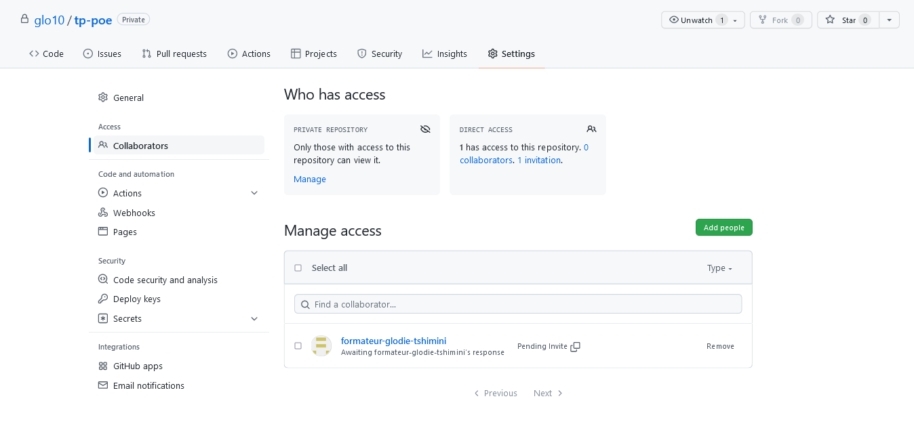

# Travaux pratiques : travail collaboratif avec Git et Github
## Consignes
## PARTIE 1

#### Formation des groupes

- Groupe de 3 personnes
- Dans chaque groupe
  - 1 Owner : créateur et responsable du dépôt Git
  - 2 developers : développeurs extérieurs qui participent au projet

#### Rôle du owner

- Tâches du owner
  1. Créer un dépôt github nommé tp-git avec les fichiers
     - README.md contenant les instructions pour récupérer le projet en local
     - .gitignore
  2.  Inviter les 2 développeurs qui doivent collaborer dans ce projet 
     
- Settings > General > Access > Collaborators > add people
     
  
     
  3. Nommer développeur 1 et nommer développeur 2 (pour pouvoir distinguer les développeurs et attribuer des tâches spécifiques à chacun)
  4. Accepter, publier ou rejeter les pull requests des développeurs
     
     - En cas de rejet, dire aux développeurs la raison du refus en utilisant les outils mis à disposition sur github
  5. Gérer les conflits
  6. En option, créer des issues et les attribuer à un développeur

#### Rôle du premier développeur

1. Accepter l'invitation reçue 
2. Récupérer le projet en local
3. Créer une nouvelle branche (par exemple feat/morning_menu)
4. Créer un dossier morning
5. Créer un fichier nommé menu.txt qui doit contenir un ou plusieurs viennoiseries, boissons de son choix avec les tarifs pour chaque 
6. Commiter et pusher vers le dépôt distant

#### Rôle du second développeur

1. Accepter l'invitation reçue 
2. Récupérer le projet en local
3. Créer une nouvelle branche (par exemple feat/lunch_menu)
4. Créer un dossier lunch
5. Créer un fichier nommé menu.txt qui doit contenir un ou plusieurs menus avec entrées, plats, boissons ou desserts de son choix avec les tarifs pour chaque 
6. Commiter et pusher vers le dépôt distant

