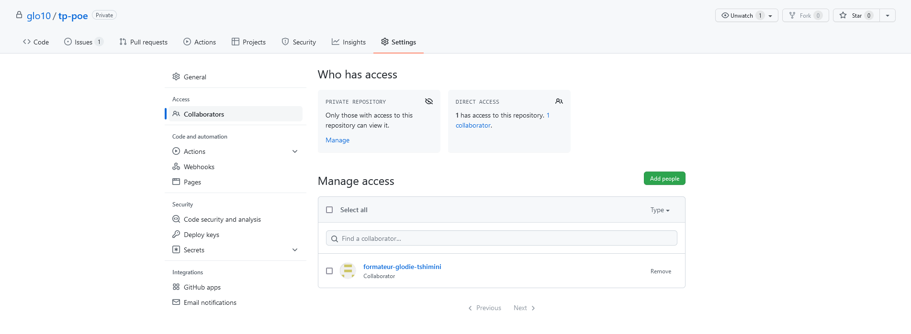

# Travaux pratiques : travail collaboratif avec Git et Github
## Consignes
## PARTIE 1

#### Formation des groupes

- Groupe de 3 personnes
- Dans chaque groupe
  - 1 Owner : créateur et responsable du dépôt Git
  - 2 Developers : développeurs extérieurs qui participent au projet

#### Rôle du owner

- Tâches du owner
  1. Créez un dépôt github nommé ***tp-git*** avec les fichiers
     - ***README.md*** contenant les instructions pour récupérer le projet en local
     - ***.gitignore***
     
  2. Invitez les 2 développeurs qui doivent collaborer dans ce projet et le formateur dont l'adresse e-mail est contact@tshimini.fr

     - **Settings > General > Access > Collaborators > add people**

     **Illustration**

  

  3. Désignez développeur 1 et développeur 2 (nécessaire pour attribuer les tâches à chacun)

  4. Créez 2 issues

     1. Première issue nommée ***feature/morning_menu*** et assigner le développeur 1

     2. Deuxième issue nommée ***feature/lunch_menu*** et assigner le développeur 2

        Vous pouvez rajouter les **Labels** de votre choix parmi la liste proposée

        **Illustration**

      

     

  5. En local

     1. Récupérez le dépôt distant
     2. Créez une branche nommée ***main*** 
     3. Modifiez la mise en page ***README.md*** en suivant ce [guide ](https://docs.framasoft.org/fr/grav/markdown.html)
   4. Pushez
  
6. Acceptez, publiez ou rejetez les pull requests de vos développeurs
  
     - En cas de rejet, dites à vos développeurs la raison du refus en utilisant les outils mis à disposition sur Github
   - Gérez les conflits lors des merge request sur la branche *main*
  
7. Après avoir effectué les merge request des travaux de vos développeurs sur la branche main
  
     1. Créez une issue nommée **feature/prices** et assignez-le à vous même
     2. Créez une nouvelle branche qui porte le même nom que l'issue
     3. Ajoutez les prix aux produits présents sur chaque ligne des fichiers ***menu.md*** et ***drink.md***
   4. Pushez vos modifications sur le dépôt distant
     5. Faites le merge request de cette branche dans la branche *main*
  
  8. Prévenez vos collaborateurs de l'ajout des prix

#### Rôle du premier développeur

1. Acceptez l'invitation reçue 
2. Récupérez le projet en local
3. Créez une nouvelle branche portant le même nom que l'issue qui vous a été assignée
4. **A la racine du projet**
   1. Créez un fichier nommé ***menu.md*** qui doit contenir vos viennoiseries préférées
   2. Créez un fichier nommé  ***drink.md*** contenant vos boissions favorites pour le pétit dejeuner 
5. Commitez et pushez vers le dépôt distant sur la branche *feature/morning_menu*
6. Faite une demande de pull request :
   1. En mettant le développeur 2 en tant que  **Reviewers** pour la revue du code
   2. Assignez le owner dans **Assignees**
   3. Ajoutez un petit commentaire pour expliquer votre travail
7. Après avoir été prévenu de l'ajout des prix sur les fichiers *menu.md* et *drink.md*
   1. Récupérez tous les changements effectués sur le dépôt distant en local
   2. S'il y a des conflits, les gérer en communiquant avec vos collaborateurs

#### Rôle du second développeur

1. Acceptez l'invitation reçue 
2. Récupérez le projet en local
3. Créez une nouvelle branche portant le même nom que l'issue qui vous a été assignée
4. **A la racine du projet**
   1. Créez un fichier nommé ***menu.md*** qui doit contenir vos plats préférées pour le déjeuner
   2. Créez un fichier nommé  ***drink.md*** contenant vos boissions favorites pour le déjeuner 
5. Commitez et pushez vers le dépôt distant sur la branche *feature/lunch_menu*
6. Faite une demande de pull request :
   1. En mettant le développeur 1 en tant que  **Reviewers** pour la revue du code
   2. Assignez le owner dans **Assignees**
   3. Ajoutez un petit commentaire pour expliquer votre travail
7. Après avoir été prévenu de l'ajout des prix sur les fichiers *menu.md* et *drink.md*
   1. Récupérez tous les changements effectués sur le dépôt distant en local
   2. S'il y a des conflits, les gérer en communiquant avec vos collaborateurs